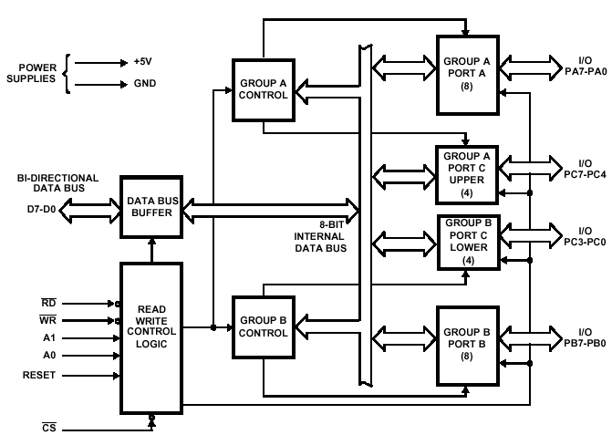

# PPI-Project
PPI Project Description : ​8255A - Programmable Peripheral Interface 

we will  implement the 8255 PPI chip in verilog. Learn about the 8255 chip  from here :  
 
- https://www.tutorialspoint.com/microprocessor/microprocessor_intel_8255a_programma ble_peripheral_interface.htm - And here : ​https://en.wikipedia.org/wiki/Intel_8255 - You can also check the datasheet here, but it is more professional and might be slightly harder to start with. Read it after you see the tutorials before. Here is the link : http://pdf.datasheetcatalog.com/datasheet/Intel/mXuttts.pdf - There are Lectures from nptel here : https://nptel.ac.in/courses/108107029/module9/lecture49.pdf https://nptel.ac.in/courses/108107029/module9/lecture50.pdf - There are also many video tutorials out there explaining the chip(mostly indians), you can learn alot from them.  - In general I think you will need to learn from a mix of all of those sources in addition to of course some googling before you can get it right. This is a real chip, so things can be slightly complicated. However, this is much better than just doing toy-examples. And after all it is still a very simple real chip, and we want you to model even a more simplified version of it. Complete reading this document to exactly know what we want you to model in verilog. 

Note the following​​: The 8255 chip has two modes of operation, BSR mode (see wikipedia for this) and I/O mode(Both Wikipedia and the tutorial explain this). Inside the I/O Mode, there are three modes of operation. 

Note:​​ There is no clock involved here at all. This is not a synchronous chip. This doesn’t mean that it doesn’t have registers. It does have registers, but it uses latches that don’t depend on clock edges. The difference between a flip-flop and a latch can be summarized as follows :  
 
For latches, the outputs are constantly affected by their inputs as long as the enable signal is present. When they are enabled, their content changes immediately when their inputs change. Flip-flops have their content change only either at the rising or trailing edge of the enable signal. This enable signal controls the clock signal. After the rising or trailing edge of the clock, the flip-flop content remains constant even if the input changes. 
 
So basically, a latch will change its input if the enable signal is high, and will preserve the old state if the enable signal is low. 
 
 
